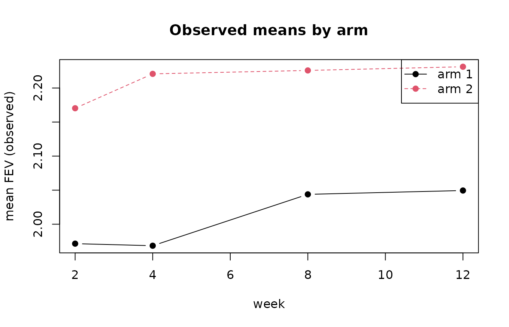
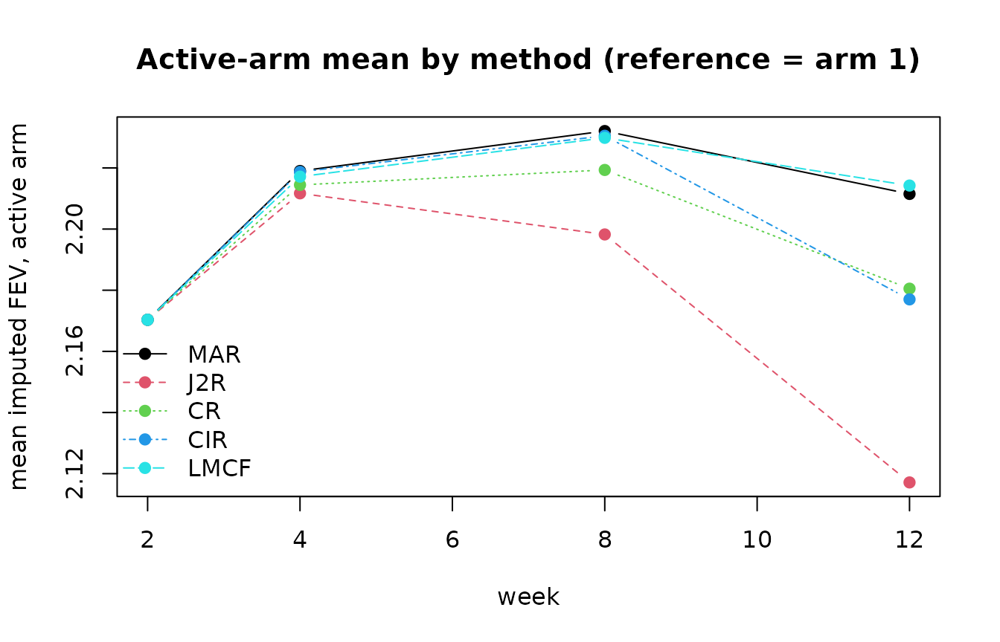

# 2. The reference-based imputation methods

This vignette explains what each method assumes about patients after
they deviate from randomised treatment, and shows the consequences on
the `asthma` trial, where the outcome `fev` is measured at weeks 2, 4, 8
and 12 and arm 1 is the reference (control).

## The assumptions

For a patient who discontinues treatment, the methods differ only in the
mean of the conditional distribution from which post-deviation values
are drawn:

| Method | Post-deviation mean | Reference arm |
|----|----|----|
| **MAR** | continues on the patient’s own arm | not required |
| **J2R** | jumps to the reference arm mean at the first missing visit | required |
| **CR** | equals the reference arm mean at every visit | required |
| **CIR** | keeps the increment gained on treatment, then accrues reference increments | required |
| **LMCF** | holds the last observed mean constant | not required |

MAR is the least conservative (the treatment benefit is assumed to
persist); CR and J2R are the most conservative for an effective
experimental arm.

## Observed mean trajectories

``` r

obs <- stats::aggregate(fev ~ treat + time, data = asthma, FUN = mean)
plot(NULL, xlim = c(2, 12), ylim = range(obs$fev), xlab = "week",
     ylab = "mean FEV (observed)", main = "Observed means by arm")
for (a in sort(unique(obs$treat))) {
  d <- obs[obs$treat == a, ]
  lines(d$time, d$fev, type = "b", lty = a, pch = 19, col = a)
}
legend("topright", legend = paste("arm", sort(unique(obs$treat))),
       lty = sort(unique(obs$treat)), col = sort(unique(obs$treat)), pch = 19)
```



## Imputed trajectories under each method

We impute the active arm (arm 2) under each method, with arm 1 as
reference, and plot the imputed mean trajectory (averaged over 20
imputations).

``` r

methods <- c("MAR", "J2R", "CR", "CIR", "LMCF")
fits <- lapply(methods, function(m) arm_means(impute_method(m)))
names(fits) <- methods

active <- lapply(fits, function(f) f[f$treat == 2, ])
yr <- range(unlist(lapply(active, function(d) d$fev)))
plot(NULL, xlim = c(2, 12), ylim = yr, xlab = "week",
     ylab = "mean imputed FEV, active arm",
     main = "Active-arm mean by method (reference = arm 1)")
for (i in seq_along(active)) {
  d <- active[[i]]
  lines(d$time, d$fev, type = "b", pch = 19, col = i, lty = i)
}
legend("bottomleft", legend = methods, col = seq_along(methods),
       lty = seq_along(methods), pch = 19, bty = "n")
```



Because most missingness in `asthma` is late dropout, the methods agree
at early visits and fan out by week 12: MAR keeps the active arm
highest, while CR and J2R pull it toward the (lower) reference arm.

## Numerical summary at the final visit

``` r

wk12 <- sapply(methods, function(m) {
  f <- fits[[m]]
  f$fev[f$treat == 2 & f$time == 12]
})
round(wk12, 3)
#>   MAR   J2R    CR   CIR  LMCF 
#> 2.211 2.117 2.181 2.177 2.214
```

## Choosing a method

- Use **MAR** as the primary analysis only if a persisting treatment
  effect after discontinuation is defensible.
- **J2R** and **CR** encode an immediate loss of benefit and are common
  conservative primary or sensitivity analyses for superiority trials.
- **CIR** is intermediate: the benefit already accrued is retained but
  no further benefit is gained.
- **LMCF** is rarely a primary analysis but is useful for comparison.
- The **causal model** provides a continuum between J2R and CIR; see
  [`vignette("causal-and-delta")`](https://choxos.github.io/RefbasedMI/articles/causal-and-delta.md).
